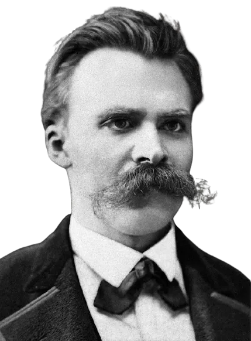

## Nietzsche

The bigger the handlebar, the more inspired the thinking.

The year is 1882, a year which began on a Sunday. John D. Rockefeller is conglomerating his monopoly. Polygamy is being made illegal in the United States. Thomas Edison is about to turn lights on outside his laboratory for the first time. Fredrick Nietzsche is wandering the Swiss mountains and about to publish *The Gay Science*.

I’ve thought a lot recently about Nietzsche and contemporary life. 

Nietzsche is often misunderstood and accused of a bad rap--of being a forerunner to Hitler’s Aryan philosophy, of introducing Nihilism to the modern world, of philosophizing with a hammer--i.e. of never really saying anything, of only destroying the scaffolding of classical Western philosophy. 

Demolition can be a lonely task and Nietzsche, while passionate, was lonely. (He proposed three times to one woman and was rejected three times.) But through it all he was an individual.

### The Gay Science
In 1882, in *The Gay Science*, he published one his most famous, misintrepreted and outlandish ideas in a section titled “The Parable of the Madman,” where a madman cries to a crowd in the marketplace: 

> God is dead. God remains dead. And we have killed him… Lightning and thunder require time, the light of the stars requires time, deeds require time even after they are done, before they can be seen and heard. This deed is still more distant from them than the distant stars - and yet they have done it themselves.
*The Gay Science*, pg. 181-82

His language invigorates still today.

#### Faith
The meaning of the passage isn’t that some literal God has died, or that honest religion is no more, but that centruries of thought, the very construction of our language has changed--and no one’s yet realized it. Society’s secularization and science’s newfound potential has inadvertently shucked morality. Big, general ideas (Plato’s *Forms*) of Good or Bad or Truth are no longer a given because they can’t exist as discrete, essential things without some sort of shared faith in meaning. Shared faith that used to come from religion, but has since been underminded in its authority by science. It’s a realization that good to one person is different from good to another.

The fact that this idea came from a man living in a world that hasn’t yet experienced two world wars, two nuclear bombs, a looming climate catastrophe only masks the larger point. The true point being that whether we want to admit it or not, we are all believers--faith is a requirement to living--and Nietzsche is asking if it’s no longer given, then what is good? What is bad? What is meaningful? 

Questions outside of science's purview. And yet the these new philosophers, Nietszche and existentialists, remain quiet on ethics. They don’t give answers, because the answers are solely the individual’s to give and believe. 

The implications are huge. Think past the big ideas, and focus on the individuality of it, the freedom, moreover the responsibility.

Nietzsche started a converstation about a new kind of freedom--unimaginable before him--in a world that today we would think formal and austere, and it strikes me as just as relevant and important today… Then again, maybe the news is still making its way.

What does it mean that humans believe computers can be trained and built to think like a human? Does that imply the imposibility of a soul or free will? What of the in vogue beliefs of muliverses and simulations? How are we replacing our fundamentals faiths? And are we conscious of it? And further yet, where do our individual responsibilities lie?

#### Embark!

>Consider how every individual is affected by an overall philosophical justification of his way of living and thinking: he experiences it as a sun that shines especially for him and bestows warmth, blessings, and fertility on him; it makes him independent of praise and blame, self-sufficient, rich, liberal with happiness and good will; incessantly it refashions evil into good, leads all energies to bloom and ripen, and does not permit the petty weeds of grief and chagrin to come at all. In the end one exclaims: How I wish that many such new suns were yet to be created! Those who are evil or unhappy and the exceptional human being-all these should also have their philosophy, their good right, their sunshine! What is needful is not pity for them. We must learn to abandon this arrogant fancy, however long humanity has hitherto spent learning and practicing it. What these people need is not confession, conjuring of souls, and forgiveness of sins; what is needful is a new *justice*! And a new watchword. And new philosophers. The moral earth, too, is round. The moral earth, too, has its antipodes. The antipodes, too, have the right to exist. There is yet another world to be discovered-and more than one. Embark, philosophers!
*The Gay Science*, pg. 231-32
